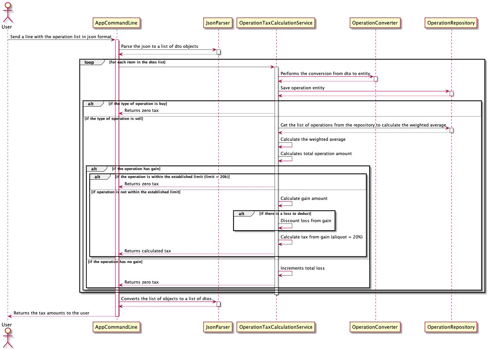

# Capital Gains

Command-line program (CLI) that calculates the tax to
be paid on gains or losses from operations in the financial stock market.

## Installation

Download the capital-gains.zip file and extract it to your preferred location.

## Usage

There are two ways to run the program:

### 1) In a non-containerized environment, for this you will need to have the following tools installed on the machine:

* Java 8 or higher
* Gradle (recommended version 7.x)

##### Running the application tests:

From the project root, run the following command:

```bash
gradle clean test
```

At the end of the execution, the test reports will be generated in the directory **"build/reports/tests"**, found from the root of the project

##### Running the application:

From the project root, run the following command:

```bash
gradle run -q
```


The program will be available to receive inputs when the following message is displayed: **"Capital Gains is Running!"**

##### You can also run the program by passing a data file as input, for that we create an example file called "input.txt" in the project root.

To run the application passing the file, just run the following command:

```bash
gradle run -q < input.txt
```

_**IMPORTANT:** At any time you can remove the "-q" from the command line to see the Gradle logs while the application is running._

### 2) In a containerized environment, just have Docker installed. <h3>

##### Running the application tests in a containerized environment: <h5>

From the project root, run the following command:

```bash
sudo docker run -i --rm -u gradle -v "$PWD":$PWD -w $PWD gradle gradle clean test
```

At the end of the execution, the test reports will be generated in the directory **"build/reports/tests"**, found from the root of the project

##### Running the application in a containerized environment:

From the project root, run the following command:

```bash
sudo docker run -i --rm -u gradle -v "$PWD":$PWD -w $PWD gradle gradle run -q
```

The program will be available to receive inputs when the following message is displayed: **"Capital Gains is Running!"**

##### Likewise, in a containerized environment you can also run the program by passing a data file as input, for that we create an example file called "input.txt" in the project root.

To run the application passing the file, just run the following command:

```bash
sudo docker run -i --rm -u gradle -v "$PWD":$PWD -w $PWD gradle gradle run -q < input.txt
```

_**IMPORTANT:** At any time you can remove the "-q" from the command line to see the Gradle logs while the application is running._

## Libraries and tools used in the project

* **Junit 5** - Used for writing and executing test cases
* **Jackson Databind** - Used for parsing JSON
* **Mockito** - Used to mock classes in test cases
* **Gradle** - Used to build, test, and run the application.

## Technical and architectural decisions

From an architectural and design point of view, this project used a simplification of Clean Architecture and some basic concepts of DDD, isolating the responsibilities and domain, in order to facilitate future maintenance, have greater flexibility in extending new features, and at the same time trying to keep the simplicity in project structuring and implementation.

From an implementation point of view, the Java language was used for reasons of greater familiarity.

Gradle was used as a build tool to facilitate the testing, construction, and execution processes of the application. In addition, it assists in generating richer test reports.

To validate the project in a containerized environment, a simpler approach was used, just executing the official base image of Gradle and informing the task we want to execute. Another option would be to build a custom image of the application, copying the artifact already built into it, and run the application directly as the main task of the container. As this project is a code challenge, the simplest strategy was kept to facilitate the validation process.

In the challenge's FAQ, it was informed that the program should not print any instruction information for the user, but in order to only indicate that the application is running, the message "Capital Gains is Running!" was placed, to prevent inputs from were performed before the container was running (for example), which could generate validation problems. If this is a problem, we can remove it, no problem.

## Diagrams

##### Get Tax By Operation (Sequence)


